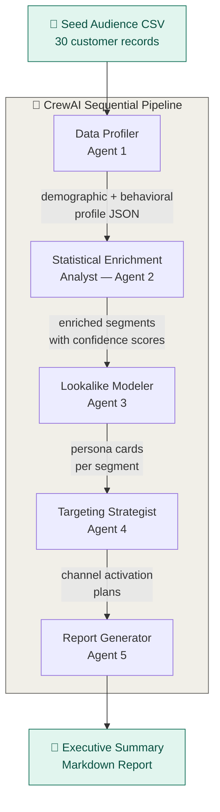
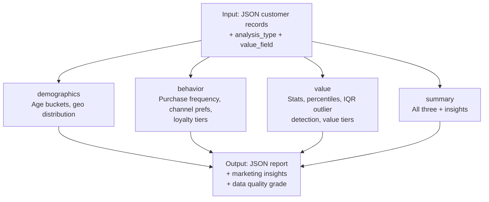
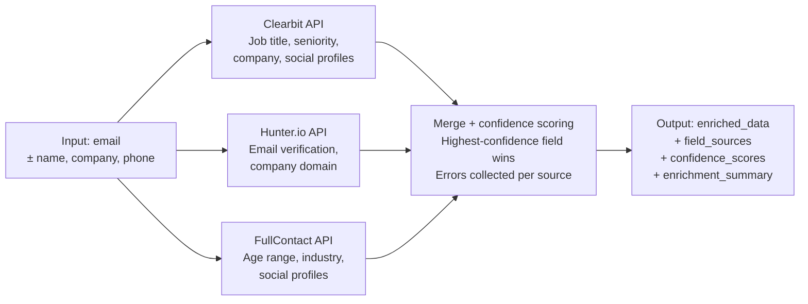

# 🧠 Advanced Audience Intelligence — Real-Time Enrichment

> A multi-agent AI system built with [crewAI](https://crewai.com) that analyzes seed audience data, enriches customer profiles, builds lookalike personas, and generates actionable targeting strategies — all in a fully automated pipeline.

---

## 📋 Table of Contents

- [Overview](#overview)
- [Architecture](#architecture)
- [Agent Pipeline](#agent-pipeline)
- [Tool Stack](#tool-stack)
- [Project Structure](#project-structure)
- [Installation](#installation)
- [Configuration](#configuration)
- [Running the Project](#running-the-project)
- [Output](#output)
- [Development](#development)

---

## Overview

This crew ingests a seed audience CSV (e.g. 30 customer records), runs it through a five-agent sequential pipeline, and produces a CMO-ready executive summary report including:

- Demographic + behavioral segmentation
- Statistical enrichment with confidence scoring
- Lookalike persona cards (one per discovered segment)
- Channel activation plans per persona
- An 8-week implementation roadmap

Built on **crewAI v1.11.0** with `gpt-4o-mini` powering all agents.

---

## Architecture

The system follows a **sequential multi-agent pipeline** — each agent's output feeds directly into the next as context.



---

## Agent Pipeline


Each agent has a distinct role, goal, and toolset:

```mermaid
flowchart LR
    subgraph A1["Agent 1 · Data Profiler"]
        direction TB
        A1R["Role: Data Analytics Expert"]
        A1T["Tools: ScrapeWebsiteTool\nCustomerAnalyticsTool"]
        A1O["Output: Age buckets, purchase\ncategories, channel %, loyalty tiers,\ndata gaps, sub-clusters"]
    end

    subgraph A2["Agent 2 · Statistical Enrichment Analyst"]
        direction TB
        A2R["Role: Statistical Analytics Expert"]
        A2T["Tools: CustomerDataEnrichmentTool"]
        A2O["Output: Enriched segments,\nconfidence intervals,\n[ESTIMATED] vs [OBSERVED] flags"]
    end

    subgraph A3["Agent 3 · Lookalike Modeler"]
        direction TB
        A3R["Role: Segmentation Specialist"]
        A3T["Tools: CustomerAnalyticsTool"]
        A3O["Output: Named persona cards\nper segment, similarity score\nthresholds (7+)"]
    end

    subgraph A4["Agent 4 · Targeting Strategist"]
        direction TB
        A4R["Role: Digital Marketing Strategist"]
        A4T["Tools: none"]
        A4O["Output: Channel plans,\nbid strategy, ad formats,\nexclusion criteria per persona"]
    end

    subgraph A5["Agent 5 · Report Generator"]
        direction TB
        A5R["Role: Marketing Communications Expert"]
        A5T["Tools: none"]
        A5O["Output: CMO-ready executive\nsummary, under 800 words\nexcluding tables"]
    end

    A1 --> A2 --> A3 --> A4 --> A5
```



---

## Tool Stack

Two custom crewAI tools power the data layer:

### `CustomerAnalyticsTool`

Statistical analysis engine for customer datasets. Supports four analysis modes:



### `CustomerDataEnrichmentTool`

Multi-API enrichment with automatic failover across **Clearbit → Hunter.io → FullContact**:



> **Note:** Each API requires its own environment variable (`CLEARBIT_API_KEY`, `HUNTER_API_KEY`, `FULLCONTACT_API_KEY`). Missing keys are handled gracefully — the tool falls back to remaining APIs and reports errors in the output.

---

## Project Structure

```
advanced_audience_intelligence_real_time_enrichment/
├── src/
│   └── advanced_audience_intelligence_real_time_enrichment/
│       ├── config/
│       │   ├── agents.yaml          # Agent role, goal, backstory definitions
│       │   └── tasks.yaml           # Task descriptions + expected outputs
│       ├── tools/
│       │   ├── customer_analytics_tool.py      # Statistical analytics engine
│       │   ├── customer_data_enrichment.py     # Multi-API enrichment with failover
│       │   └── custom_tool.py                  # BaseTool scaffold for new tools
│       ├── crew.py                  # Crew orchestration + agent/task wiring
│       └── main.py                  # Entry point — run, train, replay, test
├── AGENTS.md                        # CrewAI reference for AI coding assistants
├── pyproject.toml                   # Dependencies (crewAI 1.11.0)
├── uv.lock                          # Locked dependency tree
└── .env                             # API keys (not committed)
```

---

## Installation

**Requirements:** Python ≥ 3.10, < 3.14 · [uv](https://docs.astral.sh/uv/)

```bash
# Install uv (if not already installed)
pip install uv

# Clone the repository
git clone https://github.com/your-org/advanced-audience-intelligence.git
cd advanced-audience-intelligence

# Install dependencies
crewai install
# or: uv sync
```

---

## Configuration

### 1. Environment variables

Create a `.env` file in the project root:

```env
# Required
OPENAI_API_KEY=sk-...

# Optional — for CustomerDataEnrichmentTool
CLEARBIT_API_KEY=...
HUNTER_API_KEY=...
FULLCONTACT_API_KEY=...
```

### 2. Input

The crew expects a `csv_file_path` input — a URL pointing to your seed audience CSV. Update `main.py`:

```python
inputs = {
    'csv_file_path': 'https://your-url.com/seed_audience.csv'
}
```

**Expected CSV columns:**

| Column | Type | Description |
|---|---|---|
| `age` | int | Customer age |
| `location` | str | City or region |
| `purchase_category` | str | Product category |
| `preferred_channel` | str | e.g. email, social, direct |
| `loyalty_tier` | str | e.g. Bronze, Silver, Gold |
| `total_spent` | float | Lifetime value |
| `purchase_frequency` | int | Purchases per year |

---

## Running the Project

```bash
# Run the full pipeline
crewai run

# Or via uv
uv run run_crew

# Train for N iterations
crewai train -n 5 -f training.json

# Replay from a specific task
crewai replay -t <task_id>

# Test crew performance
crewai test -n 3 -m gpt-4o
```

---

## Output

The pipeline produces a `report.md` in the project root containing:

| Section | Contents |
|---|---|
| **Audience Snapshot** | Overall seed audience stats (seed size = 30) |
| **Segment Discovery** | Number of segments found and defining characteristics |
| **Enrichment Findings** | Sample table: original vs. estimated attributes with confidence flags |
| **Persona Cards** | One card per segment — name, age range, income tier, behavioral fingerprint |
| **Targeting Recommendations** | Channel plan per persona with bid strategy and ad format |
| **Confidence Flags** | All `[ESTIMATED]` outputs explained |
| **Next Steps** | 8-week implementation roadmap |

---

## Development

### Adding a new tool

Use `tools/custom_tool.py` as a scaffold:

```python
from crewai.tools import BaseTool
from pydantic import BaseModel, Field
from typing import Type

class MyToolInput(BaseModel):
    query: str = Field(..., description="Your input description")

class MyTool(BaseTool):
    name: str = "my_tool"
    description: str = "What this tool does and when to use it."
    args_schema: Type[BaseModel] = MyToolInput

    def _run(self, query: str) -> str:
        # Implementation
        return result
```

Then register it on the relevant agent in `crew.py`:

```python
tools=[CustomerAnalyticsTool(), MyTool()],
```

### Key commands

```bash
uv add <package>              # Add a dependency
uv sync                       # Sync lockfile
crewai reset-memories -a      # Reset all agent memories
crewai log-tasks-outputs      # Inspect latest task outputs
```

### Updating agent behavior

- **Agent personas** → edit `config/agents.yaml`
- **Task instructions** → edit `config/tasks.yaml`  
- **Tool wiring / LLM settings** → edit `crew.py`

---

## Support

- [crewAI Documentation](https://docs.crewai.com)
- [crewAI GitHub](https://github.com/joaomdmoura/crewai)
- [Discord Community](https://discord.com/invite/X4JWnZnxPb)
